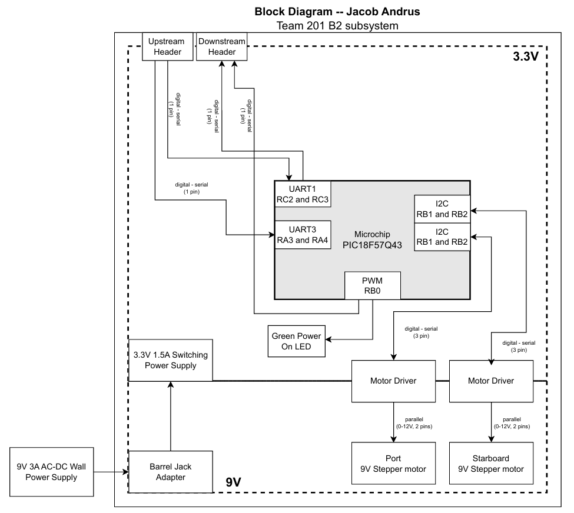
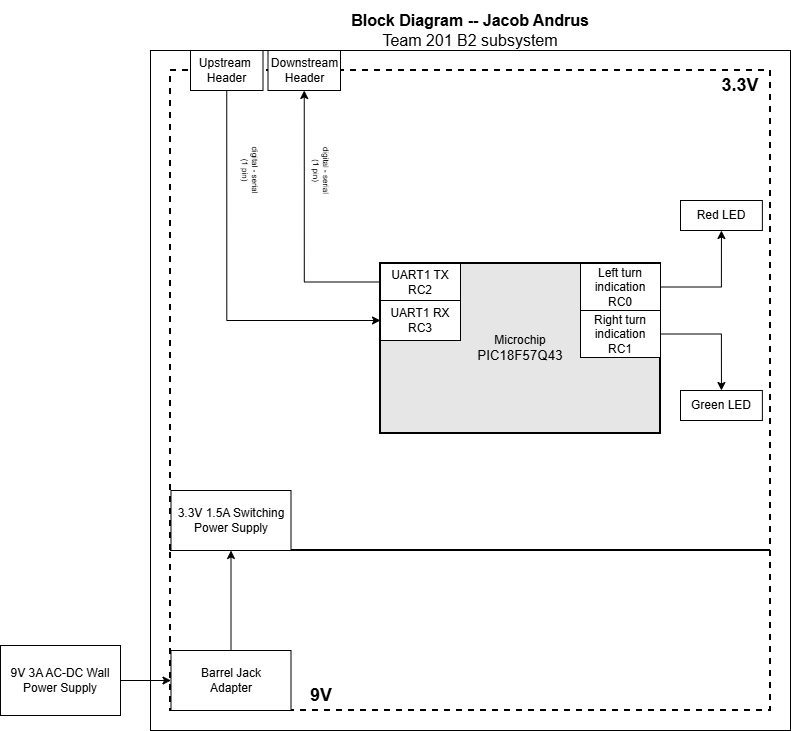

## Overview
The first block diagram depicts the intended design of Team 201's rudder subsystem. It shows a plug-in wall supply of 9V and 3A that is split between a 3.3V and 1.5A regulator as well as a 9V power rail for the stepper motors. This subsystem can connect using UART via pins RA3 and RA4 or RC2 and RC3.

The second block diagram shows the final product's block diagram. Due to a complication in coding and incorrect footprints for the PCB, the final product fell short of what the original design desired. This final design does not include any hardware that would steer the drone. Instead, I have connected 2 separate LEDs, to show how the code receives messages from the controller subsystems then acts on the steering commands.

## Rudder System Block Diagram 
The initial and final block diagrams are displayed below.

