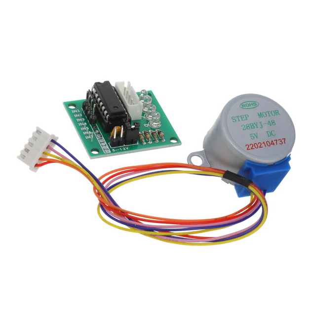
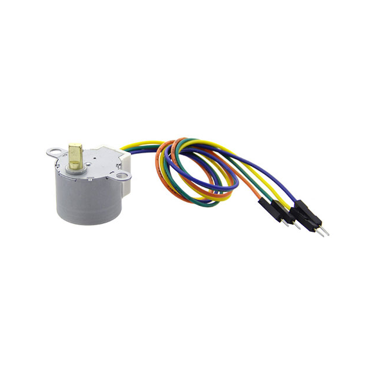
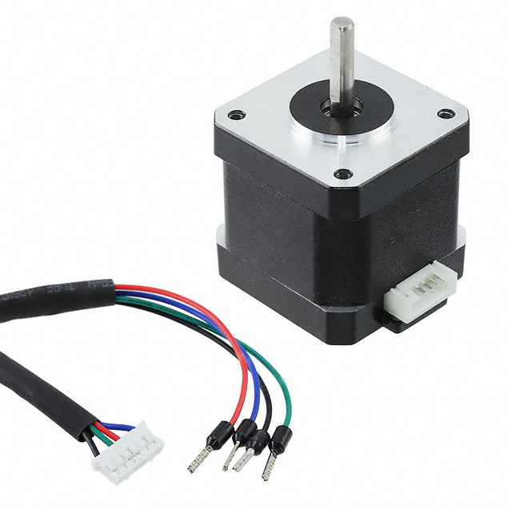

**Barrel Jack Adapter**

1. LDC-061DH-J-005-1AG-19

    

    * $1.23/each
    * [link to product](https://www.digikey.com/en/products/detail/linkplex/LDC-061DH-J-005-1AG-19/26798641)

    | Pros                                      | Cons                                                             |
    | ----------------------------------------- | ---------------------------------------------------------------- |
    | Larger solder pads for easier soldering   | Slightly more expensive                                          |
    | Lots of components in stock               | Will take up more space on PCB                                   |

2. LDC-016H-L-005-1AG-19

    

    * $1.11/each
    * [link to product](https://www.digikey.com/en/products/detail/linkplex/LDC-016H-L-005-1AG-19/26798684)

    | Pros                                      | Cons                                                             |
    | ----------------------------------------- | ---------------------------------------------------------------- |
    | Will take up less space on PCB            | Will need to check physical size of power supply                 |
    | Lots of components in stock               | Smaller solder pads                                              |
    | Slightly larger inner pin                 |

3. LDC-016H-J-005-1AG-19

    

    * $1.11/each
    * [link to product](https://www.digikey.com/en/products/detail/linkplex/LDC-016H-J-005-1AG-19/26798633)

    | Pros                                      | Cons                                                             |
    | ----------------------------------------- | ---------------------------------------------------------------- |
    | Larger solder pads for easier soldering   | Smaller solder pads                                              |
    | Lots of components in stock               | Slightly smaller inner pin                                       |

**Choice:** Option 2: LDC-016H-L-005-1AG-19

**Rationale:** I chose the second barrel jack because while it's price is the same as the third and only slightly lower than the first barrel jack adapter, it has a larger inner pin than the other 2 choices. This will allow for a tighter grip between the wall power supply and the PCB, to ensure there are no loose connections.

**3.3 V Switching Power Supply**

1. AZ1117IH-3.3TRG1

    

    * $0.24/each
    * [link to product](https://www.digikey.com/en/products/detail/diodes-incorporated/AZ1117IH-3-3TRG1/5699672)

    | Pros                                      | Cons                                                             |
    | ----------------------------------------- | ---------------------------------------------------------------- |
    | Inexpensive                               | Requires external components and support circuitry for interface |
    | Compatible with ESP32                     | Needs special PCB layout                                         |
    | 3.3 V and 1 A                             |

2. AS78L05RTR-E1

    

    * $0.13/each
    * [link to product](https://www.digikey.com/en/products/detail/diodes-incorporated/AS78L05RTR-E1/4470943)

    | Pros                                      | Cons                                                             |
    | ----------------------------------------- | ---------------------------------------------------------------- |
    | 1 output                                  | 5 V and 100 mA                                                   |
    | Stable over operating temperature         | 24 week manufacturer lead time                                   |
    | Extremely cheap                           |

3. TCR2EF33,LM(CT

    

    * $0.12/each
    * [link to product](https://www.digikey.com/en/products/detail/toshiba-semiconductor-and-storage/TCR2EF33-LM-CT/4503183)

    | Pros                                      | Cons                                                             |
    | ----------------------------------------- | ---------------------------------------------------------------- |
    | Large quantity in stock                   | 12 week manufacturer lead time                                   |
    | Stable over operating temperature         |
    | 3.3 V and 200 mA                          |

**Choice:** Option 3: TCR2EF33,LM(CT

**Rationale:** The current output may be less, but this regulator won't require a special PCB layout and won't take 24 weeks to be shipped. 

**Motor Drivers**

1. DRV11873PWPR

    

    * $2.15/each
    * [link to product](https://www.digikey.com/en/products/detail/texas-instruments/DRV11873PWPR/3903327)

    | Pros                                      | Cons                                                             |
    | ----------------------------------------- | ---------------------------------------------------------------- |
    | Can use 1 driver for both motors          | Expensive                                                        |
    | Can handle up to 17 V loads               | Takes up a lot space                                             |
    | Versatile                                 | 18 week manufacturer lead time                                   | 

2. DRV10974PWPR

    

    * $2.30/each
    * [link to product](https://www.digikey.com/en/products/detail/texas-instruments/DRV10974PWPR/8635379)

    | Pros                                      | Cons                                                             |
    | ----------------------------------------- | ---------------------------------------------------------------- |
    | Can use 1 driver for both motors          | More Expensive                                                   |
    | Can handle up to 18 V loads               | Takes up a lot space                                             |
    | Versatile                                 | 18 week manufacturer lead time                                   | 

3. RS8837YK

    

    * $0.44/each
    * [link to product](https://www.digikey.com/en/products/detail/runic-technology/RS8837YK/24819274)

    | Pros                                      | Cons                                                             |
    | ----------------------------------------- | ---------------------------------------------------------------- |
    | Extremely cheap                           | Will have to use a driver for each stepper motor                 |
    | 8 week manufacturer lead time             | Can only handle up to 14 V loads                                 |
    | Can use 3.3 V to power the driver         |

**Choice:** Option 3: RS8837YK

**Rationale:** I can use the same voltage level to power the microcontroller and drivers and still be able to power the stepper motors. It also has the best manufacturer lead time and is the cheapest of the 3.

**Stepper motors**

1. SM-5VDC-DRV

    

    * $2.96/each
    * [link to product](https://www.digikey.com/en/products/detail/olimex-ltd/SM-5VDC-DRV/21662223)

    | Pros                                      | Cons                                                             |
    | ----------------------------------------- | ---------------------------------------------------------------- |
    | 5 week manufacturer lead time             | Rated for 5 V                                                    |
    | Inexpensive component                     | Incomplete datasheet                                             |

2. 108990003

    

    * $4.50/each
    * [link to product](https://www.digikey.com/en/products/detail/seeed-technology-co-ltd/108990003/5487797)

    | Pros                                      | Cons                                                             |
    | ----------------------------------------- | ---------------------------------------------------------------- |
    | Easy to mount                             | Rated for 5 V                                                    |
    | Lots of available inventory               | 33 week manufacturer lead time                                   |
    | Somewhat inexpensive                      |

3. FIT0278

    

    * $13.95/each
    * [link to product](https://www.digikey.com/en/products/detail/dfrobot/FIT0278/6588458)

    | Pros                                      | Cons                                                             |
    | ----------------------------------------- | ---------------------------------------------------------------- |
    | 9 week manufacturer lead time             | Rated for 3.4 V                                                  |
    | Larger shaft for easy visualization       | Expensive                                                        |

**Choice:** Option 3: FIT0278

**Rationale:** Even though this is the most expensive motor, it has the closest rated voltage to the microcontroller and will arrive within a reasonable time.