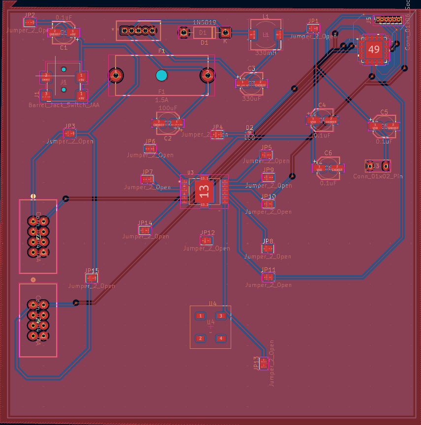
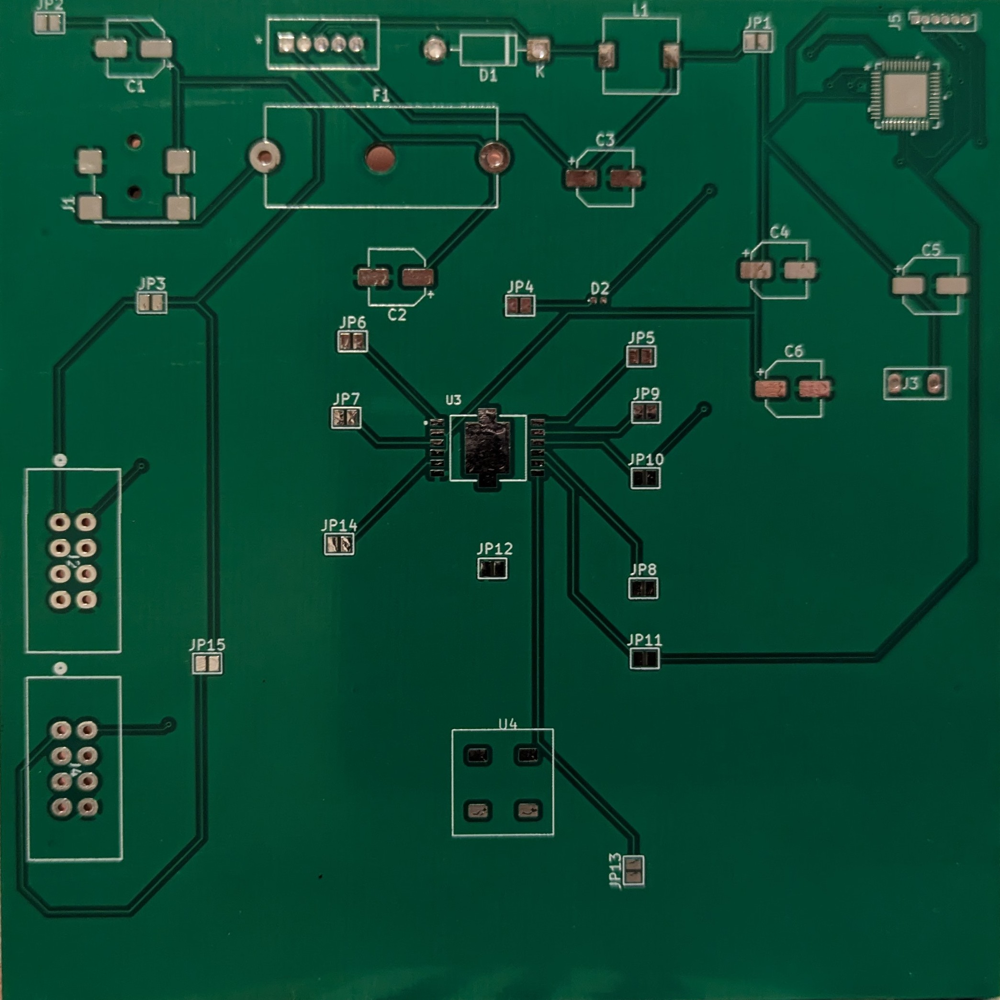
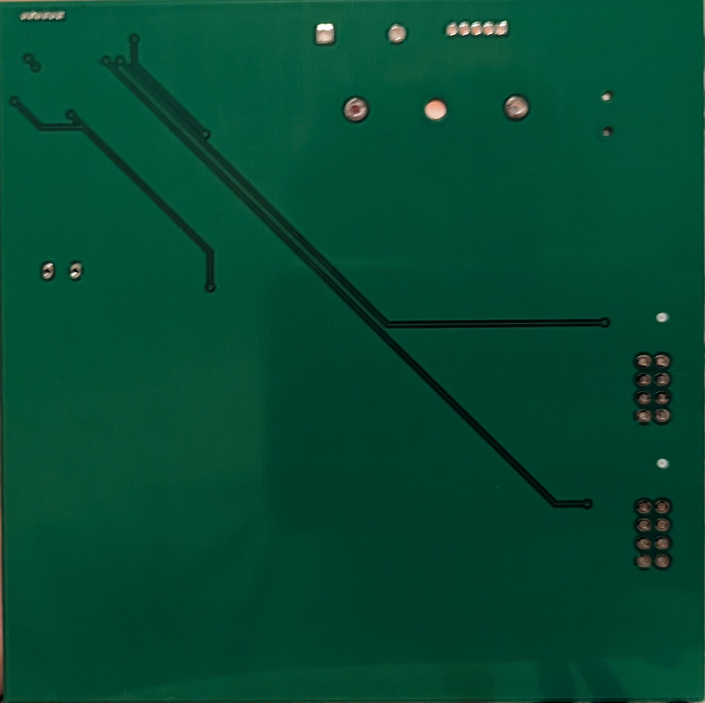
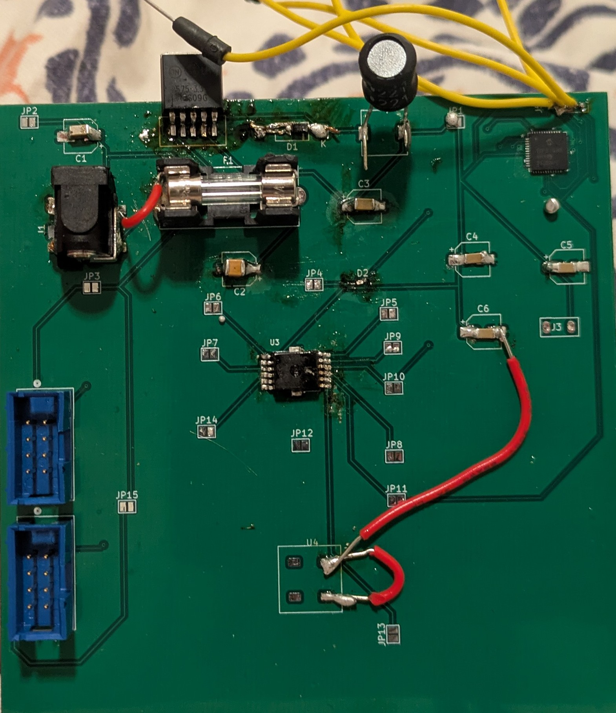
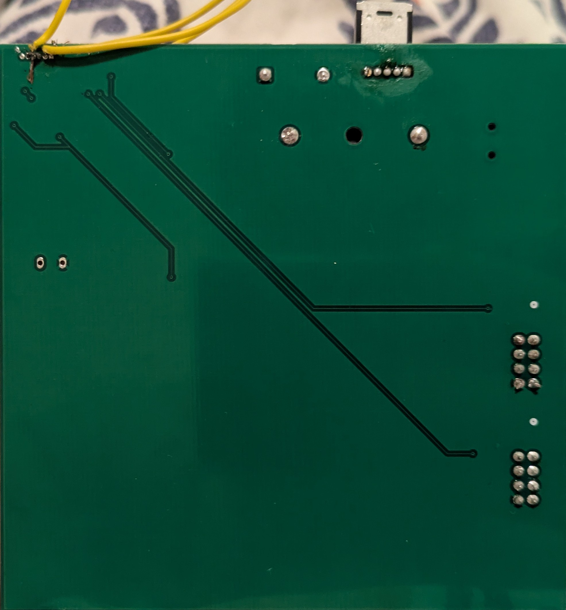

## Overview

The rudder's printed circuit board (PCB) can be found here, including the top and bottom copper layers, as well as the silkscreens, solder masks and edge cuts. The final product can also be seen here, with pictures of the finished PCB before and after soldering.

**Figure 1:** Top copper layer of rudder PCB

{style width:"350" height:"300;"}

**Figure 2:** Bottom copper layer of rudder PCB

{style width:"350" height:"300;"}

**Figure 3:** Front of PCB before soldering

{style width:"350" height:"300;"}

**Figure 4:** Back of PCB before soldering

{style width:"350" height:"300;"}

**Figure 5:** Front of PCB after soldering

{style width:"350" height:"300;"}

**Figure 6:** Back of PCB after soldering

{style width:"350" height:"300;"}

## Resouces

The Gerber files and Drill files of the PCB can be found [*here*](JacobAndrus.zip). JLCDFM was used to confirm minimal issues with PCB design and the analysis report can be found [*here*](DFM_analysis_report_JLCDFM_gerber_drill.zip.pdf).