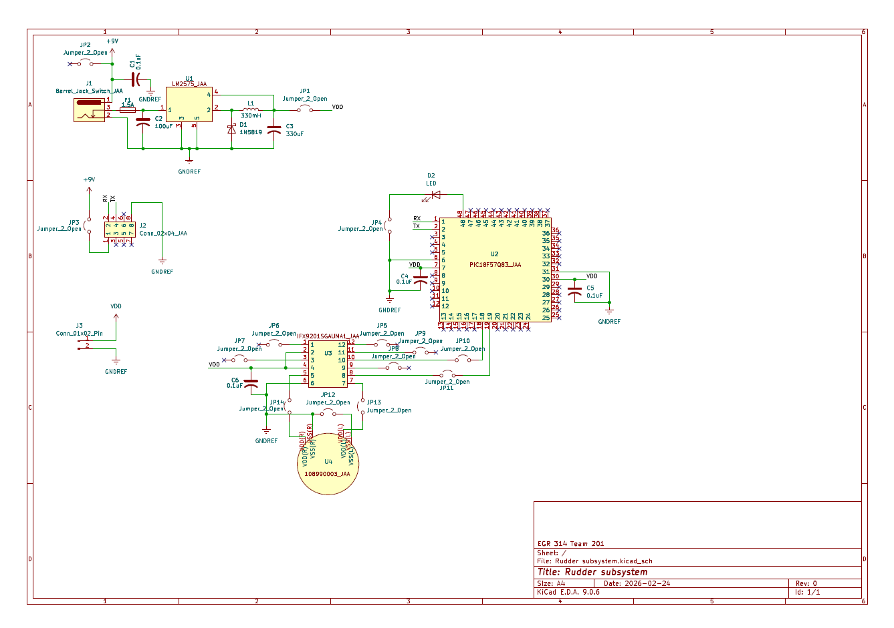

## Overview

This schematic is design to support Team 201's project for the Spring 2026 semester of EGR 314. This specific subsystem utilizes a 3.3V switching power regulator which powers a MicroChip microcontroller and motor driver. A stepper motor is connected to the motor driver, which will act as a rudder for the drone as it sails through water.

{style width:"350" height:"300;"}
**Figure 1:** Details of the rudder subsystem

## Resouces

The schematic as a PDF download is available [*here*](Rudder_subsystem.pdf), and the Zip folder of the project [*here*](Rudder_subsystem.zip).