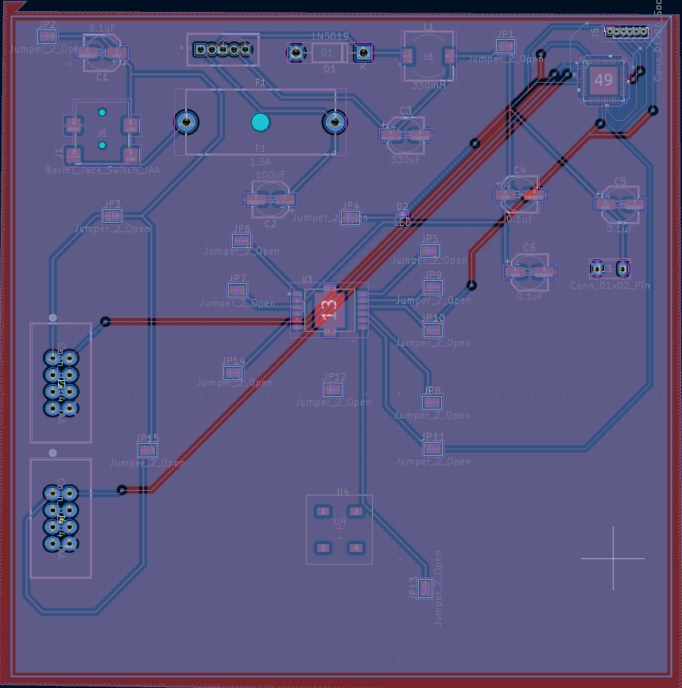

## Overview

The rudder's printed circuit board (PCB) can be found here, including the top and bottom copper layers, as well as the silkscreens, solder masks and edge cuts. 

**Figure 1:** Top copper layer of rudder PCB

{style width:"350" height:"300;"}

**Figure 2:** Bottom copper layer of rudder PCB

{style width:"350" height:"300;"}

## Resouces

The Gerber files and Drill files of the PCB can be found [*here*](JacobAndrus.zip). JLCDFM was used to confirm minimal issues with PCB design and the analysis report can be found [*here*](DFM_analysis_report_JLCDFM_gerber_drill.zip.pdf).