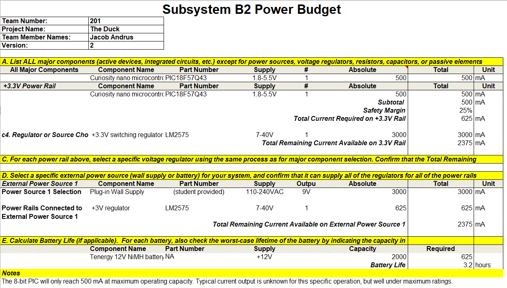

The power budget for subsystem B2 is calculated in the following chart:

The spreadsheet used to calculate this is available [here](Power_Budget.xlsx) as an Excel spreadsheet.

During the Innovation Showcase event, the rudder motor was nonfunctional. The power supply that was used, was the Tenergy battery, which powered only passive components and the 8-bit PIC on my board. The final product operated for a continuous 7 hours. These findings are expected, as the concrete number used from the datasheet was a maximum, since "standard operating" power draw data was largely unavailable.